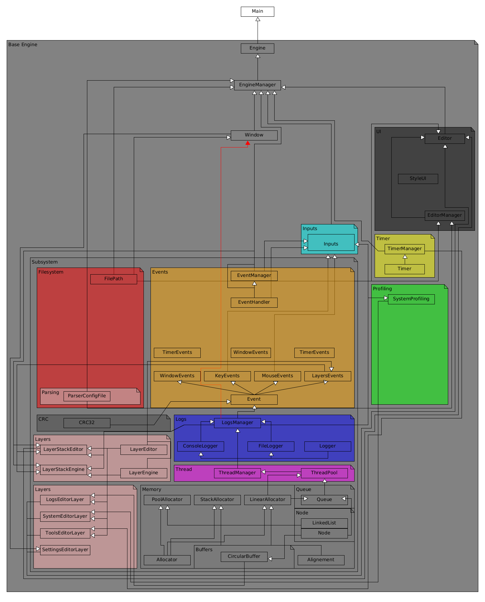
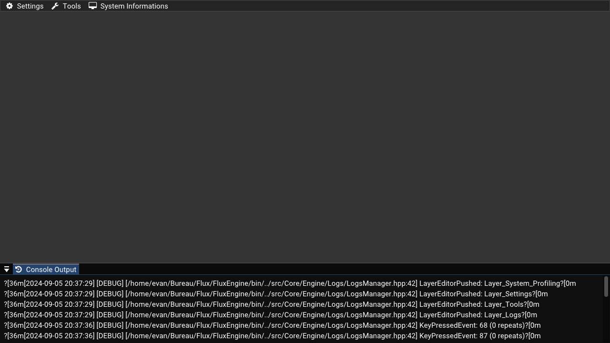

# FluxEngine

Début de développement de mon moteur de jeux / de rendus.

<figure>      <figcaption> Aperçu de la structure de mon moteur</figcaption> </figure> 

<figure>      <figcaption> Aperçu du début du moteur</figcaption> </figure> 
